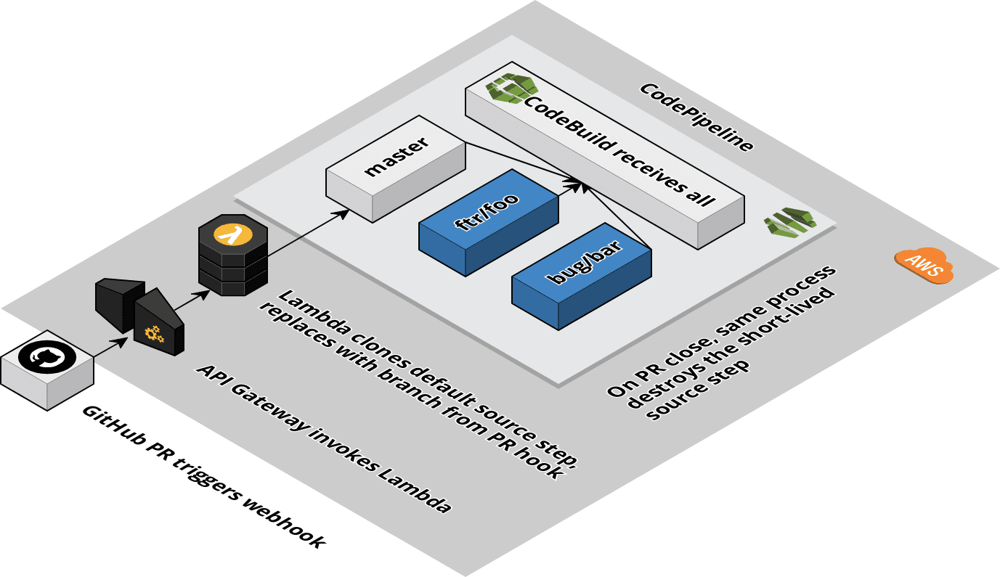

# AWS CodePipeline Multiplexer

Terraform module to dynamically create AWS CodePipeline source steps

AWS CodePipeline does not currently support catching arbitrary source branches; a desirable feature that would allow short-lived branches such as pull requests to trigger builds and tests. This Terraform module solves that by attaching a webhook to the source GitHub repository that posts back to AWS API Gateway upon pull request events. API Gateway invokes AWS Lambda, which in turn clones the default CodePipeline source step and replaces its selected branch with the PR branch. A similar process takes place upon pull request closed events to destroy the ephemeral source step.

## Diagram

  

<!-- BEGINNING OF PRE-COMMIT-TERRAFORM DOCS HOOK -->

## Inputs

| Name | Description | Type | Default | Required |
|------|-------------|:----:|:-----:|:-----:|
| artifact_bucket | Name of an S3 bucket to store artifacts in. If not specified, one will be created. | string | `` | no |
| artifact_bucket_kms_key | ARN of the artifact bucket's KMS key used for encryption. If not specified, one will be created. | string | - | yes |
| codebuild_compute_type | - | string | `BUILD_GENERAL1_SMALL` | no |
| codebuild_image | - | string | `aws/codebuild/docker:17.09.0` | no |
| codebuild_os | - | string | `LINUX_CONTAINER` | no |
| codebuild_privileged_mode | - | string | `true` | no |
| github_branch_default | Git branch for the default CodePipeline source step to watch | string | `master` | no |
| github_oauth_token_ssm_param | Name of AWS SSM Parameter that holds a GitHub OAuth token. Must be of type `SecureString` | string | - | yes |
| github_organization | GitHub organization that owns the source repository | string | - | yes |
| github_repository | GitHub source repository | string | - | yes |
| iam_role_codebuild | ARN of an IAM role for CodeBuild to run as. If not specified, one will be created. | string | `` | no |
| iam_role_codepipeline | ARN of an IAM role for CodePipeline to run as. If not specified, one will be created. | string | `` | no |
| iam_role_lambda | ARN of an IAM role for Lambda to run as. If not specified, one will be created. | string | `` | no |

<!-- END OF PRE-COMMIT-TERRAFORM DOCS HOOK -->
